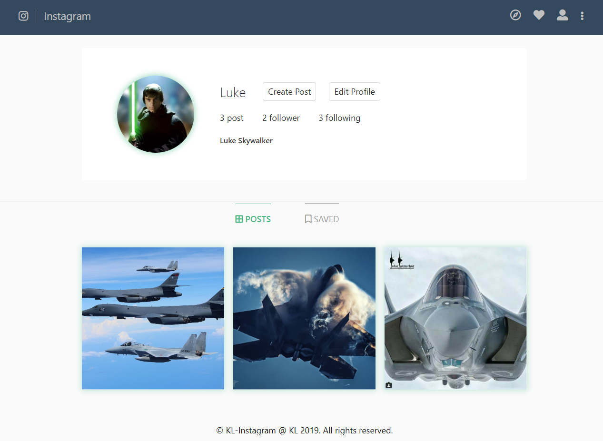

# kl-instagram

The application is a Stateful app built with [Spring Boot](http://spring.io/projects/spring-boot), [MySQL](https://www.mysql.com/) and [Vue.js](https://vuejs.org).

Features:
- Routing
- User authentication: Register/Login/Logout
- 3 User Roles: Root, Admin and User
- Promoting/Demoting users to Admin/User
- Deleting users
- Editing user profile
- Following/Unfollowing users
- Creating posts
- Creating comments
- Liking posts


## Requirements

1. Java 11

2. In order to be able to save `Images` you need to sign up to [Cloudinary](https://cloudinary.com/) and enter your credentials in the `application.properties` file of the Spring Boot app (`instagram\server\src\main\resources\application.properties`)

## Start the app

### **Option 1 - Start the Client and the Server manually**

#### 1. Start the Client

To start the Client you need to enter the `instagram/client` folder:

```bash
$ cd instagram/client
```

Install all dependencies:

```bash
$ npm install
```

Run the app in the development mode:

```bash
$ npm run serve
```

Open [http://localhost:8080](http://localhost:8080) to view it in the browser.

#### 2. Start the Server

Go to the root directory of the Spring Boot app:

```bash
$ cd instagram/server
```

Start the Server:

```bash
$ mvn spring-boot:run
```
The Server is running on port `8000`.

### **Option 2 - Start the application in Docker**

1. **Start the application**

Go to the project directory( `instagram/` ) and run:

```bash
$ docker-compose up -d
```

The front-end server will start on port `9090`. To open it enter in your browser:

```bash
$ http://localhost:9090
```
2. **Stop the application**

You can stop the containers with:

 ```bash 
 $ docker-compose down
 ```

 ## App screenshots

1. **Home Page**

 

2. **People Page**

 

3. **User Feed Page**

 

4. **Post Page**

 
